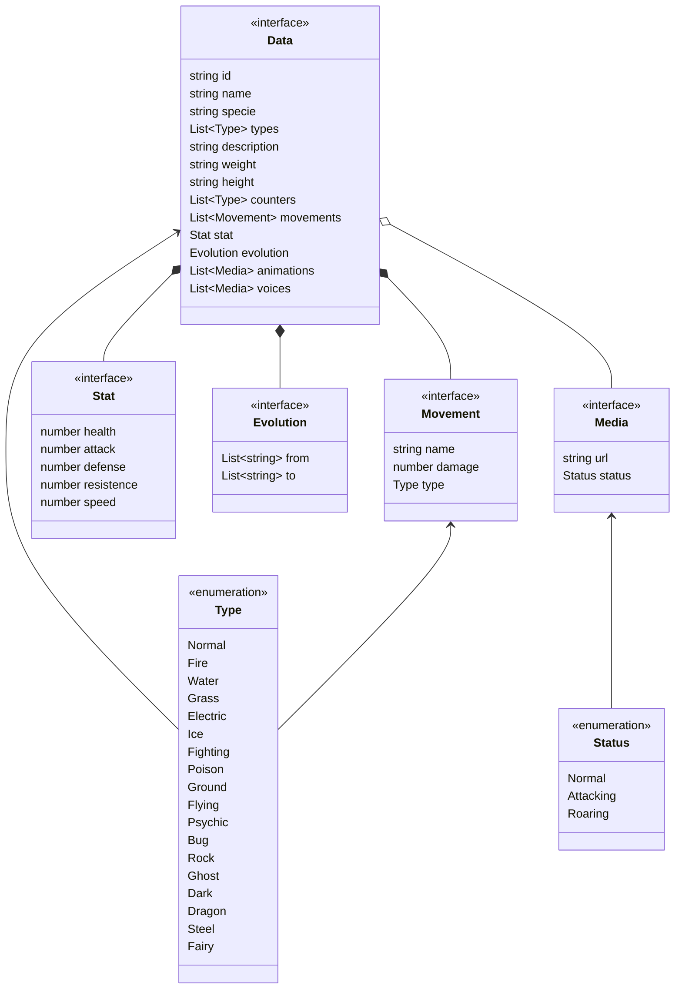

# Pokedex Web App

...

## Challenge

...

## Solution

...

## Entities Model Diagram

```mermaid
classDiagram

class Data {
  <<interface>>
  string id
  string name
  string specie
  List~Type~ types
  string description
  string weight
  string height
  List~Type~ counters
  List~Movement~ movements
  Stat stat
  Evolution evolution
  List~Media~ animations
  List~Media~ voices
}

class Type {
  <<enumeration>>
  Normal
  Fire
  Water
  Grass
  Electric
  Ice
  Fighting
  Poison
  Ground
  Flying
  Psychic
  Bug
  Rock
  Ghost
  Dark
  Dragon
  Steel
  Fairy
}

class Movement {
  <<interface>>
  string name
  number damage
  Type type
}

class Stat {
  <<interface>>
  number health
  number attack
  number defense
  number resistence
  number speed
}

class Evolution {
  <<interface>>
  List~string~ from
  List~string~ to
}

class Media {
  <<interface>>
  string url
  Status status
}

class Status {
  <<enumeration>>
  Normal
  Attacking
  Roaring
}

Data <-- Type
Data o-- Media
Data *-- Stat
Data *-- Movement
Data *-- Evolution
Movement <-- Type
Media <-- Status
```
